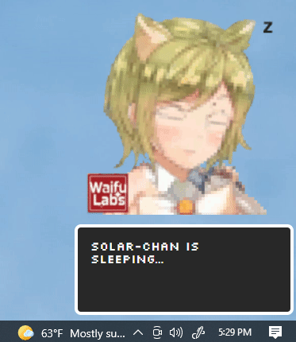

### Solar-chan
A desktop companion representing an ESP-01 microcontroller powered by two solar cells and some super capacitors.

Yeah this is a weird project but I made it so here it is.

#### Desktop app

#### Body assembled

#### Schematic

#### Architecture

### Stack
* Node http/socket server
* ElectronJS desktop app
* ESP-01 with WiFi/http

### Disclaimer about the 3D printed design
This is poorly designed, I barely put any time into it, it has low tolerance/sloppy and it needs a top brace (I added with scrap plastic).

Print time is 2 hours

### Note about securty
The [Content-Security-Policy](https://stackoverflow.com/questions/43742261/is-it-unsafe-to-add-localhost-to-content-security-policy) in the Electron app is set to accept localhost/a certain local 192 IP address. If you want to use https you can remove that/set your server up to use https. For my use it's just a local thing.

### Font
[Silkscreen](https://www.dafont.com/silkscreen.font) by Jason Aleksandr Kottke